# delegate

## 1. ทฤษฎีและหลักการก่อนการทดลอง

### 1.1 แนะนำ delegate

* Delegate เป็นการสร้างออปเจ็กต์ขึ้นมา 1 ตัว เพื่่อที่จะเก็บ reference ไปยังเมธอดอื่น (หรือหลายๆ เมธอด) เวลาจะเรียกใช้เมธอดนั้น เราจะเรียก delegate แทน
* ถ้าหากเราเชื่อม delegate หนึ่งไว้กับเมธอดหลายๆ ตัว การเรียกใช้ delegate ก็จะเป็นการเรียกให้เมธอดเหล่านั้นทำงานในครั้งเดียว
* Delegate ช่วยให้การสร้างโปรแกรมมีความยืดหยุ่นตรงที่เราสามารถเขียนโปรแกรมเพื่อที่จะเรียกใช้เมธอดอื่น โดยที่ยังไม่ต้องสร้างเมธอดนั้นขึ้นมาจริงๆ (สามารถคอมไพล์ผ่านถึงแม่เมธอดปลายทางจะยังไม่ถูกเขียนขึ้นก็ตาม)
เราสามารถเพิ่ม method จากคลาสใดๆ ได้ แต่ต้องมี signature ตรงกับ delegate ไม่ว่าเมธอดนั้นจะอยู่ใน instance ของ class หรือเป็น static method

### 1.2 An Overview of Delegates

* delegate จัดเป็น user-defined type ชนิดหนึ่ง นั้นก็คือการที่จะเรียกใช้งาน delegate ได้จะต้องสร้างออปเจ็กต์ก่อนเช่นเดียวกับการใช้งานคลาส
* สามารถใช้งานได้แบบเดียวกับ class หรือ built-in type
* ลำดับในการสร้างและใช้งาน delegate
  1. declare delegate type
  2. declare delegate variable
  3. create delegate object (and add some methods)
  4. invoke the delegate (เราเรียก invoke เพราะ delegate ต่างจาก method และสามารถ hold หลายๆ method ไว้ในตัว)

### 1.3 Class vs. Delegate

ในการใชังานคลาสและ delegate จะมีส่วนที่คล้ายกัน สามารถนำแนวทางในการสร้างคลาสและใช้งานออปเจ็กต์มาใช้กับ delegate ได้
พิจารณาจากรูปที่ 1 

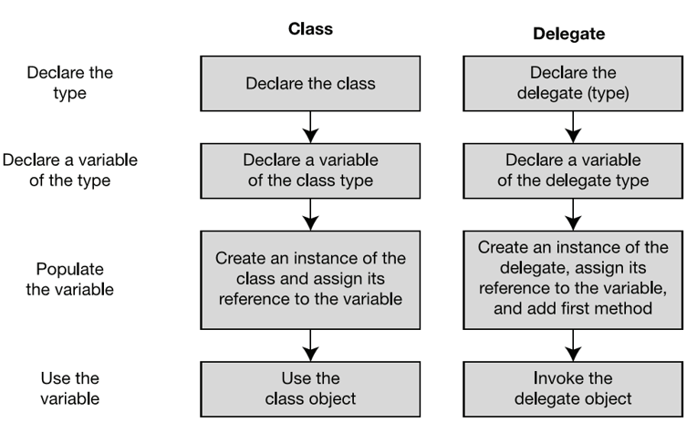

<p style="text-align: center;">  รูปที่ 1 </p>

ด้านซ้ายมือจะเป็นขั้นตอนในการสร้างและใช้งานคลาส ส่วนด้านขวามือเป็นการสร้างและใช้งาน delegate

### 1.4 Concept ของ delegate

* รายการ method ที่เก็บใน delegate object เรียกว่า invocation list
* method ที่จะเก็บใน delegate อาจเป็น method ภายใน object ใดๆ ก็ได้ หรือ method แบบ static
* ต้องมี return type เหมือนกับของ delegate
* ต้องมี signature (parameter list) เหมือนกับของ delegate ทุกประการ (ทั้งชนิดและจำนวน)

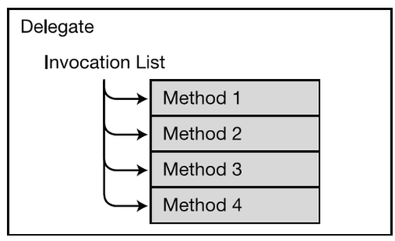

<p style="text-align: center;">  รูปที่ 2 </p>


### 1.5 Declaring the Delegate Type

การประกาศรูปแบบของ delegate  จะมีหน้าตาคล้ายกับการประกาศเมธอด ต่างกันตรงที่มี keyword คำว่า delegate นำหน้า ดังรูปที่ 3 

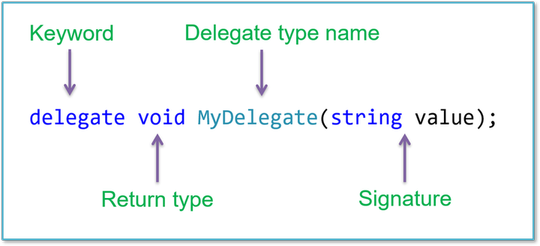

<p style="text-align: center;">  รูปที่ 3 </p>

### 1.6 ลักษณะเด่นของ Delegate

* delegate มีการประกาศ (declare) เหมือนเมธอดทั่วๆ ไป ต่างกันตรงที่มีคำว่า delegate นำหน้า 
* ในรายละเอียดแล้วนั้น delegate ต่างจากเมธอดตรงที่ 
  * ไม่มี method body
  * ไม่ต้องประกาศภายใต้ class เนื่องจากมันเป็น type เช่นเดียวกับ class

## 2. การใช้งาน delegate

### 2.1 Creating the Delegate Object

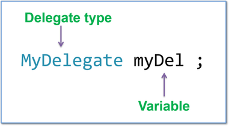

<p style="text-align: center;">  รูปที่ 4 </p>


ถึงแม้ว่ารูปแบบในการประกาศ delegate จะมีหน้าตาคล้ายเมธอดก็ตาม แต่ตัว delegate เองนั้นมีสถานะเป็น type (เทียบเท่ากับ class)
ดังนั้นการใช้งานจะต้องสร้าง reference และเชื่อมกับออปเจ็กต์ก่อนเสมอ

เช่นเดียวกับการสร้างออปเจ็กต์ทั่วๆ ไป เราสามารถสร้าง delegate ขึ้นใหม่ หรือเชื่อม dalegate ไปยังิิปเจ็กต์ที่มีอยู่ได้ดังวิธีการต่อไปนี้

####  1. ใช้ keyword “new”

การสร้าง delegate ใหม่ เพื่อเชื่อมไปยังออปเจ็กต์
``` C#
    MyDelegate myDel = new MyDelegate {obj.method};
```

การสร้าง delegate ใหม่ เพื่อเชื่อมไปยังเมธอดแบบ Static 
``` C#
    MyDelegate myDel1 = new MyDelegate {StaticMethod};
```

#### 2. สร้างโดยใช้ short cut

การเชื่อม delegate ไปยังออปเจ็กต์

```C#
    MyDelegate myDel =  obj.method ;
```

การเชื่อม delegate ไปยังเมธอดแบบ Static 
```C#
    MyDelegate myDel1 =  StaticMethod;
```

#### ตัวอย่าง การสร้าง object ของ delegate

```C#
    // ประกาศ delegate (เป็น data type)
    delegate void MyDel(int x);


    // สร้าง reference ออปเจ็กต๋ที่มี type เป็น delagate 
    MyDel delVar, dVar;

    // สร้างออปเจ็กต์ใหม่ แล้วนำมาเชื่อมกับ reference ของออปเจ็กต์ที่มี type เป็น delagate 
    delVar = new MyDel( myInstObj.MyM1 );
    dVar = new MyDel( SClass.OtherM2 );
```

### 2.2 Instantiating the delegates

การสร้าง reference ของ delagate นั้นเป็นเพียงการสร้าง reference ขึ้นมาหนึ่งตัว ที่พร้อมจะเชื่อมไปยังเมธอดใดๆ ได้ตามต้องการ (และสามารถลบออกได้ด้วย)

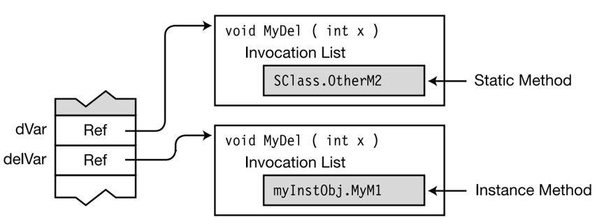

#### The new keyword vs shortcut

รูปที่ 5

```C#
    //new keyword
    MyDel delVar = new MyDel(myInstObj.MyM1);
    MyDel dVar = new MyDel(SClass.OtherM2);

    //shortcut
    MyDel delVar = myInstObj.MyM1;
    MyDel dVar = SClass.OtherM2;
```

### 2.3 Assigning Delegates

ในการกำหนดออปเจ็กต์ที่จะเชื่อมเข้ากับ reference ของ delegate เราก็สามารถทำได้เช่นเดียวกับออปเจ็กต์ที่สร้างจาก class โดยทั่วไป

```C#
    // Create delegate reference.
    MyDel delVar;

    // assign the delegate object.
    delVar = myInstObj.MyM1;
    ...

    // assign the new delegate object.
    delVar = SClass.OtherM2;
```
จากโปรแกรมด้านบน จะพบว่าหากมีการ assign ออปเจ็กต์ใหม่ให้กับ delegate จะทำให้ออปเจ็กต์เดิมถูกตัดออกจาก reference เช่นเดียวกับการกระทำกับออปเจ็กต์ที่เกิดจากคลาส แต่ในกรณีนี้จะไม่เกิด resource leak เนื่องจากกระบวนการสร้างและทำลายออปเจ็กต๋ (อายุของออปเจ็กต์) จะไม่ขึ้นกับ delegate 
ให้พิจารณารูปที่่ 6

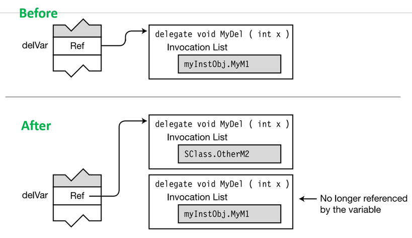

รูปที่ 6

### 2.4 Combining Delegates

เราสามารถทำการ combine ให้ delegate หลายๆ ตัว เข้าด้วยกันได้ 
ผลจากการ combine จะได้ object ของ delegate ตัวใหม่ โดยไม่ส่งผลกระทบใดๆ กับ delegate เดิมที่เป็นต้นฉบับ 

```C#
    MyDel delA = myInstObj.MyM1;
    MyDel delB = SClass.OtherM2;
    MyDel delC = delA + delB; 
    // Has combined invocation list
```
จากโค้ดข้างบน สามารถอธิบายการทำงานได้ดังรูปที่ 7

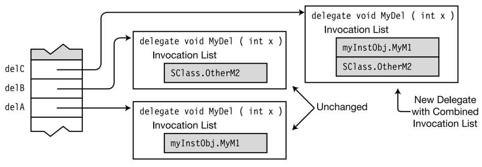

รูปที่ 7

### 2.5 Adding Methods to Delegates

เมื่อสร้าง reference ของ delegate ขึ้นมาแล้ว เราสามารถเพิ่มเมธอดต่างๆ เข้าไปใน invocation list ได้โดยการใช้โอเปอเรเตอร์ `+=` โดยเมธอดที่จะเพิ่มเข้าไปนั้นจะต้องมี signature ตรงตามที่ประกาศไว้ใน signature ของ delagate

```C#
    MyDel delVar = inst.MyM1; // Create and initialize.
    delVar += SCl.m3; // Add a method.
    delVar += X.Act; // Add a method.
```


รูปที่ 8

* ในความจริง delegate จะมีคุณสมบัติ immutable คือไม่สามารถเปลี่ยนรูปได้
* การเพิ่ม method ลงไปใน delegate จะเป็นการสร้าง delegate ขึ้นมาใหม่ แล้วย้าย reference ไปจาก delegate object เดิม
* เราสามารถเพิ่ม method ได้เรื่อยๆ ทุกครั้งที่มีการเพิ่ม ระบบจะสร้าง delegate object ขึ้นมาใหม่ แล้วย้าย reference ไปชี้ยัง delegate ใหม่นั้นเสมอ

### 2.6 Removing Methods from a Delegate

* เราสามารถลดความสามารถของ delegate โดยการลบ method ทำได้โดยการใช้ operator `-=`
เช่นเดียวกับการเพิ่ม method
* การลบ method จะทำได้โดยการสร้าง delegate object ใหม่โดยไม่นำ method ที่ลบออกมารวมด้วย 
* จากนั้นจะย้าย reference มายัง delegate ใหม่ที่สร้างขึ้น
* ผู้ใช้ไม่ต้องสนใจว่าทำได้อย่างไร (เป็นหน้าที่ของ frame work)

```C#
    delVar -= SCl.m3; 
    // Remove the method from the delegate.
```

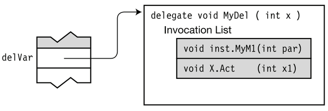

รูปที่ 9

#### ข้อควรจำ

* ถ้าใน invocation list มี method เดียวกันซ้ำๆ กันหลายที่ 
  * -= operator จะเริ่มค้นหาจากด้านล่างของ invocation list (ตัวที่เพิ่มเข้าไปล่าสุด) และลบ method แรกที่เจอ
  * การพยายามลบ method ที่ไม่อยู่ใน invocation list จะไม่ส่งผลกระทบใดๆ
  * การพยายามเรียกใช้ (invoke) delegate ที่ว่างเปล่า (ถูกลบออกจนหมด) จะเกิด exception ดังนั้นควรตรวจสอบว่า delegate เป็น null หรือไม่ก่อนที่จะ invoke

### 2.7 Invoking a Delegate

* การ invoke delegate ก็เหมือนการเรียกใช้ method ทั่วๆ ไป แต่ต้องเรียกตามรูปแบบที่ประกาศไว้เท่านั้น
* การ invoke ด้วย parameter ก็จะส่ง parameter นั้นไปยัง method ที่อยู่ใน invocation list ด้วย

```C#
    MyDel delVar = inst.MyM1;
    delVar += SCl.m3;
    delVar += X.Act;
    ...
    delVar( 55 ); // Invoke the delegate.
    ...
```

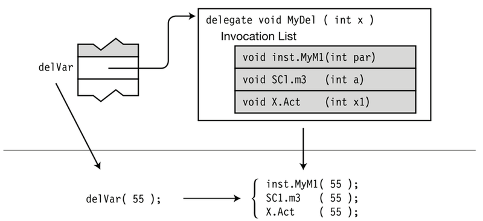

รูปที่ 10

## 3. Delegate example

### 3.1 Example1


รูปที่ 11

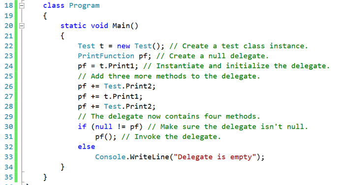

รูปที่ 12

### 3.2 Example 2: Invoking Delegates with Return Values

* ถ้า delegate มีการส่งค่ากลับ และใน invocation list มี method มากกว่า 1 แล้ว การ invoke delegate จะเป็นไปตามกฏต่อไปนี้ 
  * เฉพาะค่าส่งกลับจาก method สุดท้ายใน invocation list จะถูกนำไปใช้
  * ค่าส่งกลับจาก methods อื่นๆ ใน invocation list จะถูกเพิกเฉย


รูปที่ 13

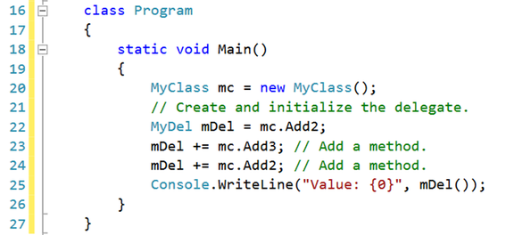

รูปที่ 14

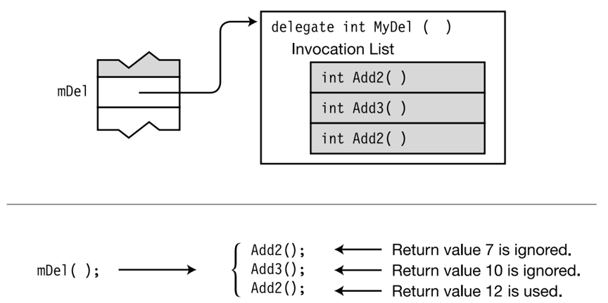

รูปที่ 15

### 3.3 Example 3: Invoking Delegates with Reference Parameters

* ถ้า delegate มี parameter เป็นแบบ reference ค่าของ parameter จะถูก update ให้เป็นปัจจุบันก่อนเรียกใช้เสมอ

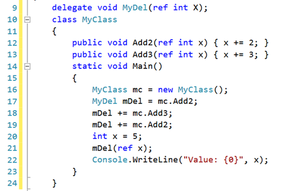

รูปที่ 16

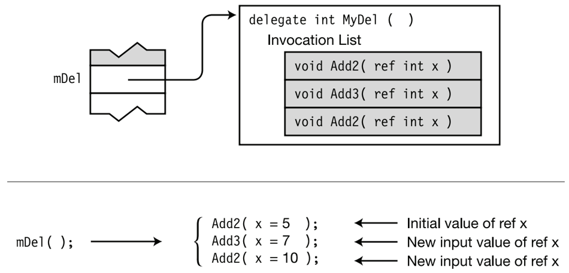

รูปที่ 17

## 4. Anonymous Methods

* ใน delegate เราสามารถใส่ method ได้ทั้งแบบ static และ instance
method เหล่านั้น ต้องเป็น member ของ struct หรือ class
* แต่ถ้าเราต้องการใส่ code ที่ทำงานเพียงครั้งเดียว ไม่จำเป็นต้องสร้างเป็น method ไว้ใน delegate จะทำอย่างไร
  * ไม่จำเป็นต้องนำ code เหล่านั้นไปใส่ใน method (หรือหาที่อยู่ให้มัน)
  * เราสามารถใช้ anonymous method มาทำงานแทน

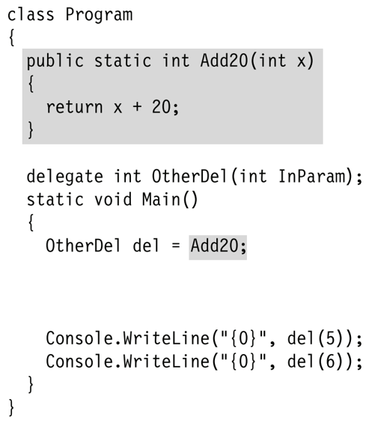

รูปที่ 18

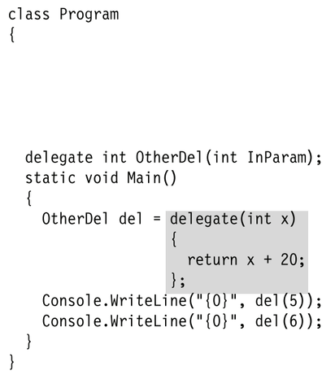

รูปที่ 19

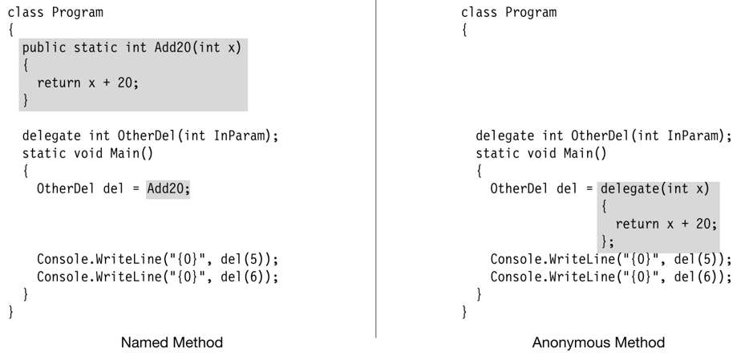

รูปที่ 20

### 4.1 การใช้งาน anonymous method

ใช้เป็น initializer expression ในขณะประกาศตัวแปร delegate
ใช้ที่ด้านขวาของสมการตอนทำ combining delegates.
ใช้ที่ด้านขวาของการกำหนด delegate ให้กับ event
เนื่องจากการเขียนโปรแกรม multithread จะเป็นแบบ asynchronous จึงต้องใช้ delegate ในการเรียกใช้ method ที่อยู่คนละ thread

### 4.2 รูปแบบของ anonymous method


ใน anonymous method ไม่จำเป็นต้องระบุ return type

### 4.3 anonymous method : Return type 

```C#
delegate int OtherDel(int InParam);
static void Main()
{
    OtherDel del = delegate(int x)
    {
        return x + 20 ; // Returns an int
    };
    ...
}
```

### 4.4 anonymous method : Parameters

Parameter list ของ anonymous method จะต้องตรงตามของ delegate ตามส่วนประกอบดังนี้
จำนวน 
ชนิดและตำแหน่ง 
modifiers
แต่เราสามารถละ parameters ได้ถ้า
delegate parameter ไม่มีตัวใดทีเป็น out parameter
anonymous method ไม่จำเป็นต้องใช้ parameter

### 4.5 anonymous method : params Parameters
params parameter ช่วยให้เราสามารถป้อน parameter ให้กับ method เป็นจำนวนเท่าใดก็ได้
params parameter คืออะไร? 

#### ตัวอย่าง params Parameters

```C#
public static void UseParams(params int[] list)
{
       ...
}

public static void UseParams2(params object[] list)
{
       ... 
}

static void Main()
{
	UseParams(1, 2, 3, 4);
	UseParams2(1, 'a', "test");
}
```

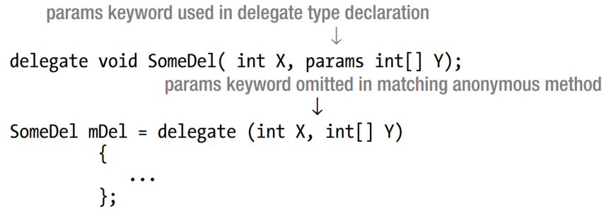

ถ้ามีการประกาศ params parameter  ในรายการ parameter  ของ delegate list แล้ว ให้ตัดคำว่า  params ออกจาก anonymous method


## 5. Lambda Expressions

ใน anonymous method คำว่า delegate ถือเป็นส่วนเกิน
เนื่องจาก compiler รู้แล้วว่าเราต้องการกำหนด method ให้ใช้งานกับ delegate (ใช้กับอย่างอื่นไม่ได้)
เราสามารถเปลี่ยนรูปแบบการประกาศ delegate ของ anonymous method ให้ง่ายขึ้นโดยการ
ตัดคำว่า delegate
เพิ่ม => ระหว่าง parameter list และ body ของ anonymous method (ก็คือส่วนที่ล้อมรอบด้วย {} )

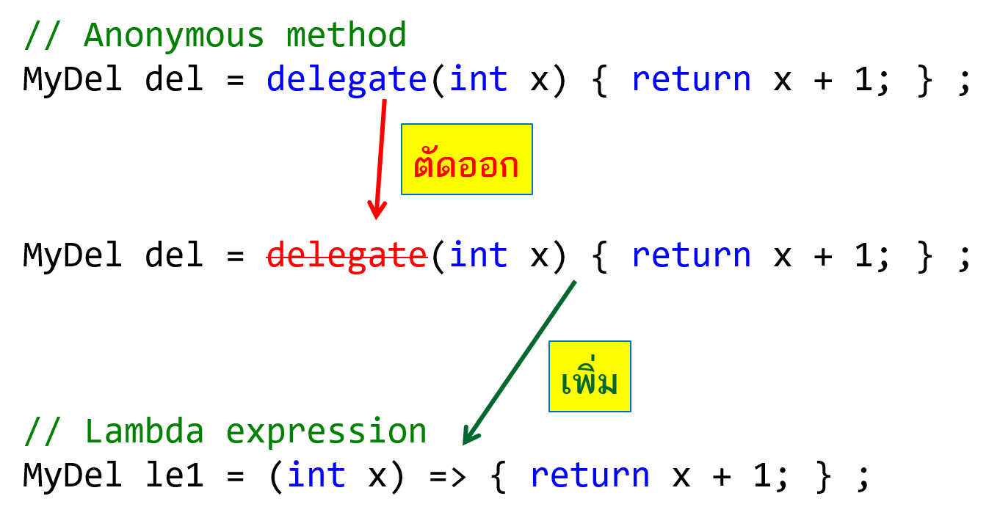


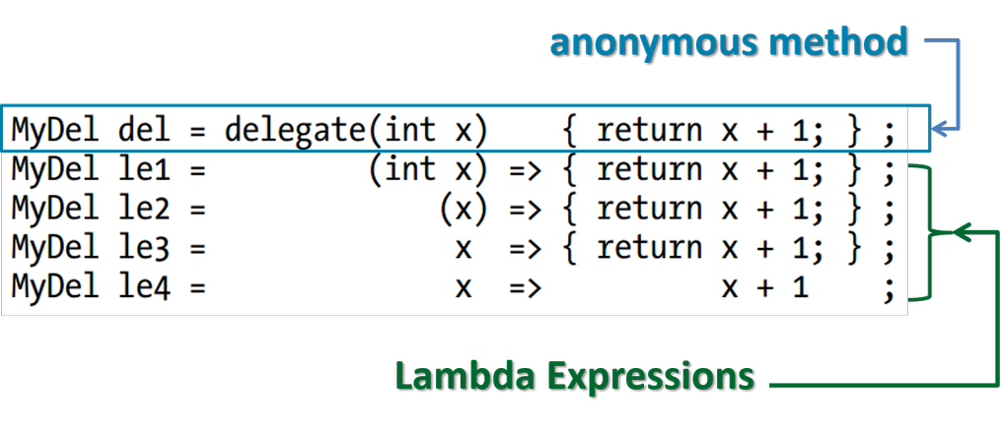


methods ทั้งหมดข้างบน ให้ผลลัพธ์เหมือนกัน
เลือกเองว่าจะเขียนแบบไหน 
ตอนเริ่มต้นอาจทำความเข้าใจยากหน่อย


